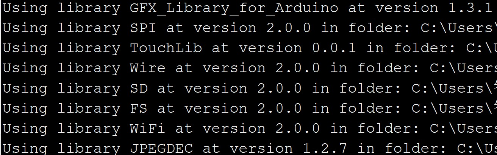
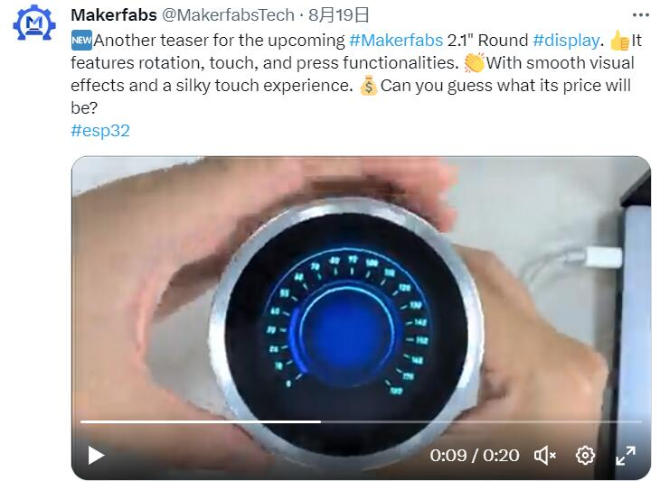
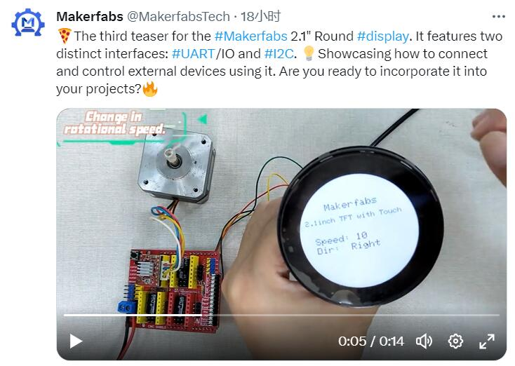

MaTouch ESP32-S3 Rotary IPS Display with Touch 2.1 ST7701

```c++
/*
Version:		V1.0
Author:		Vincent
Create Date:	2023/8/24
Note:


*/
```


# Makerfabs

[Makerfabs home page](https://www.makerfabs.com/)

[Makerfabs Wiki](https://wiki.makerfabs.com/)

## Intruduce

Product Link:[]()

Wiki Link : []()


## Features

Specs:
- Controller: ESP32-S3
- Wireless: WiFi& Bluetooth 5.0
- Touch Panel Driver: CST826
- USB: USB Native, Type-C
- Power Supply: USB Type-C 5.0V(4.0V~5.25V)
- Button: Flash button and reset button
- Arduino support: Yes
- MicroPython support: Yes
- Operation temperature: -40℃ to +85℃


# Usage

## Libraries

Related library versions



- Use type-c use cable connect USB-TTL to PC.
- Select "ESP32-S3 DEV Module"
- Select PSRAM "OPI PSRAM"

"mf_Lvgl" library is modified from Lvgl library (version 8.3.2). 

Please unzip "lib/mf_Lvgl.zip","TouchLib" and copy to arduino library directory.


## Example

### fw_test

Factory test program.
Test screen display and touch, as well as ring encoders and press switches.

### fs_test

No SD card is required, files are stored in SPIFFS in Flash, and the display is switched by rotary encoder.


### squareline_demo

SquareLine demo.




### stepper_control

Control stepper motor rotation speed, rotation direction.


